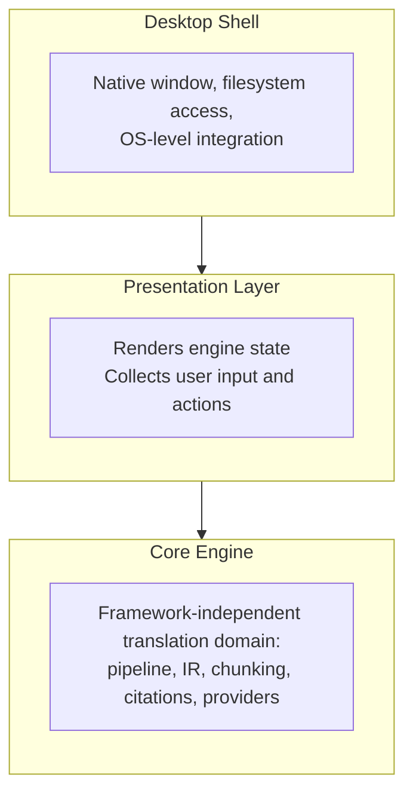

> Was a sentence unclear? Instead of ignoring it, make a simple 'edit' and leave your name in the
> history of this page's improvement.

# Overview

Perseus is a desktop application that helps Wikipedia contributors translate English Wikipedia
articles into valid Wikitext for a supported target wiki. Perseus itself never writes to Wikipedia,
publication is a manual, external step.

That single fact: Perseus produces drafts, not edits, shapes the rest of the system. It is why the
architecture treats translation as an interruptible, inspectable, editable process rather than a
one-shot pipeline run, and it is the first of several guiding principles laid out in
[Architectural Principles](./architectural-principles.md).

## System layers

Perseus is organized as three layers with a strict dependency direction: presentation depends on the
engine, never the reverse.

- **Core Engine** owns the entire translation domain: parsing a source article, resolving links,
  building an Intermediate Representation, splitting it into chunks, translating, merging, and
  generating Wikitext. It knows nothing about how it is displayed or hosted. This boundary is what
  allows the engine to be tested, reasoned about, and evolved independently of the UI.
  - see [Architectural Principles](./architectural-principles.md) for why this separation is treated
    as load-bearing rather than incidental.

- **Presentation Layer** renders the engine's state and forwards user actions into it. It holds no
  translation logic of its own, every decision about _how_ an article is translated is made by the
  engine; the presentation layer only decides how that process is displayed and interacted with.
- **Desktop Shell** hosts the presentation layer as a native application and is the only layer with
  access to the underlying operating system (windowing, filesystem, opening external links).

## Major subsystems

The core engine is organized around a small set of subsystems, each responsible for one part of the
translation domain:

| Subsystem                   | Responsibility                                                                                                                                   | Documented in                                                      |
| --------------------------- | ------------------------------------------------------------------------------------------------------------------------------------------------ | ------------------------------------------------------------------ |
| Pipeline                    | Orchestrates the stages an article passes through, from loading to Wikitext generation                                                           | [pipeline.md](./pipeline.md)                                       |
| Intermediate Representation | The structural, framework-independent model of an article that every stage reads or writes                                                       | [intermediate-representation.md](./intermediate-representation.md) |
| Chunking & Translation      | Splits an article into independently translatable units and defines a single translation protocol shared by every translator, human or automated | [chunking-and-translation.md](./chunking-and-translation.md)       |
| Translation Package         | The self-contained, on-disk representation of a translation session                                                                              | [translation-package.md](./translation-package.md)                 |
| Citation Handling           | Preserves citation structure by keeping it opaque to every stage that would otherwise mutate it                                                  | [citation-handling.md](./citation-handling.md)                     |
| Target Wiki                 | The configuration boundary that determines which wiki an article is translated for, and everything downstream that depends on it                 | [target-wiki.md](./target-wiki.md)                                 |
| LLM Providers               | The abstraction that lets translation be carried out by any of several interchangeable model providers                                           | [llm-providers.md](./llm-providers.md)                             |

## How to read this documentation

Start with [Architectural Principles](./architectural-principles.md), it establishes the mental
model (why `chunks`, why an `Intermediate Representation`, why a `Translation Package`, why
citations are handled the way they are) that the rest of the documents assume. From there, the
documents are ordered to follow an article's own path through the system: pipeline, then the
representation it operates on, then chunking and translation, then how a session is persisted, then
the two subsystems _citations and target wiki_ that modify how translation behaves, and finally the
provider abstraction that executes it.

Each document covers exactly one concept. Where a concept has already been explained elsewhere,
later documents link back rather than repeat the explanation.
