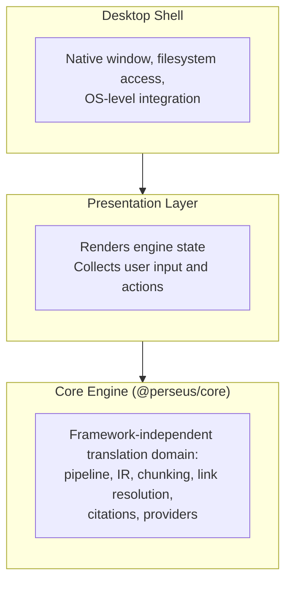

> Was a sentence unclear? Instead of ignoring it, make a simple 'edit' and leave your name in the
> history of this page's improvement.

# Overview

Perseus is a desktop application that helps Wikipedia contributors translate English Wikipedia
articles into valid Wikitext for a supported target wiki. Perseus itself never writes to Wikipedia,
publication is a manual, external step.

That single fact: Perseus produces drafts, not edits, shapes the rest of the system. It is why the
architecture treats translation as an interruptible, inspectable, editable process rather than a
one-shot pipeline run, and it is the first of several guiding principles laid out in
[Architectural Principles](./architectural-principles.md).

## System layers

Perseus is organized as three layers with a strict dependency direction: presentation depends on the
engine, never the reverse.

```mermaid
flowchart TB
    subgraph Shell["Desktop Shell"]
        direction TB
        S1["Native window, filesystem access,\nOS-level integration"]
    end

    subgraph Presentation["Presentation Layer"]
        direction TB
        P1["Renders engine state\nCollects user input and actions"]
    end

    subgraph Engine["Core Engine (@perseus/core)"]
        direction TB
        E1["Framework-independent translation domain:\npipeline, IR, chunking, link resolution,\ncitations, providers"]
    end

    Shell --> Presentation
    Presentation --> Engine
```

- **Core Engine** (this repository, `@perseus/core`) owns the entire translation domain: loading a
  source article, parsing it into an Intermediate Representation, resolving links, extracting
  translatable content, chunking, translating, merging, and generating Wikitext. It knows nothing
  about how it is displayed or hosted. This boundary is what allows the engine to be tested, reasoned
  about, and evolved independently of the UI — see
  [Architectural Principles](./architectural-principles.md) for why this separation is treated as
  load-bearing rather than incidental.
- **Presentation Layer** renders the engine's state and forwards user actions into it. It holds no
  translation logic of its own — every decision about _how_ an article is translated is made by the
  engine; the presentation layer only decides how that process is displayed and interacted with.
- **Desktop Shell** hosts the presentation layer as a native application and is the only layer with
  access to the underlying operating system (windowing, filesystem, opening external links).

## Major subsystems

The core engine is organized around a small set of subsystems, each responsible for one part of the
translation domain:

| Subsystem                     | Responsibility                                                                                                                          | Documented in                                                       |
| ------------------------------ | ---------------------------------------------------------------------------------------------------------------------------------------- | -------------------------------------------------------------------- |
| Pipeline                       | Orchestrates the fixed stage sequence an article passes through, from loading to Wikitext generation                                   | [pipeline.md](./pipeline.md), [pipeline-stages.md](./pipeline-stages.md) |
| Intermediate Representation     | The structural, framework-independent model of an article that every stage reads or writes                                              | [intermediate-representation.md](./intermediate-representation.md)  |
| Parsing & Parsoid Integration   | Turns Wikitext into IR via the real Parsoid service, and IR back into Wikitext at the end                                                | [parsing-and-parsoid.md](./parsing-and-parsoid.md)                  |
| Template Handling               | Which templates are opaque, which expose translatable parameters, and how their structure is preserved through translation              | [template-handling.md](./template-handling.md)                      |
| Comment Handling                 | Why HTML comments never reach translation, and where that's enforced                                                                    | [comment-handling.md](./comment-handling.md)                        |
| Link Resolution                 | Resolves internal wikilinks and categories against the target wiki via Wikidata, including redirects and the interwiki fallback         | [link-resolution.md](./link-resolution.md)                          |
| Chunking & Translation           | Splits an article into independently translatable units and defines a single translation protocol shared by every translator, human or automated | [chunking-and-translation.md](./chunking-and-translation.md)        |
| Translation Session             | The on-disk, JSON representation of a translation in progress, and its save/resume checkpoint                                            | [translation-session.md](./translation-session.md)                  |
| Citation Handling                | Preserves citation structure by keeping it opaque to every stage that would otherwise mutate it                                          | [citation-handling.md](./citation-handling.md)                      |
| Target Wiki                     | The configuration boundary that determines which wiki an article is translated for, and everything downstream that depends on it         | [target-wiki.md](./target-wiki.md)                                  |
| LLM Providers                   | The text-provider abstraction the built-in executor uses, and the Wikimedia provider's own whole-revision protocol                       | [llm-providers.md](./llm-providers.md)                              |

## How to read this documentation

Start with [Architectural Principles](./architectural-principles.md) — it establishes the mental
model (why `chunks`, why an `Intermediate Representation`, why a `Translation Session`, why
citations and templates are handled the way they are) that the rest of the documents assume. From
there, [pipeline.md](./pipeline.md) and [pipeline-stages.md](./pipeline-stages.md) walk the fixed
stage sequence an article moves through; the remaining documents each cover one subsystem those
stages depend on, in roughly the order an article encounters them: parsing and Parsoid integration,
template handling, comment handling, link resolution, chunking and translation, translation sessions,
citation handling, target wiki configuration, and finally the provider abstraction that executes
translation.

Each document covers exactly one concept. Where a concept has already been explained elsewhere, later
documents link back rather than repeat the explanation.

## A note on how this documentation set came to be

This documentation set was rebuilt from a direct reading of the current source and test suite, using
an earlier documentation archive as historical input rather than as a source of truth. Where the two
disagreed, the code won. The most significant corrections from the earlier archive:

- The Wikimedia provider is now a fully wired-in, selectable translation executor — earlier
  documentation described it as not yet connected to the pipeline. See
  [LLM Providers](./llm-providers.md#the-wikimedia-provider).
- A ninth pipeline stage, Reference Attention, exists and runs today but is not part of the pipeline's
  own named stage list and its output is not currently consumed anywhere. See
  [pipeline-stages.md](./pipeline-stages.md#8-reference-attention-not-a-numbered-stage).
- Link resolution has grown substantially: it now canonicalizes redirects before querying Wikidata,
  resolves wikilinks found inside translatable template parameters (not just ordinary body links),
  and can fall back to an interwiki-style template call when no target-wiki article exists. See
  [Link Resolution](./link-resolution.md).
- Template handling now protects HTML comments found inside a translatable template parameter's
  wikitext value, closing a gap where such comments were previously sent to translation verbatim. See
  [Comment Handling](./comment-handling.md).

Implementation comments that captured genuinely useful reasoning have been moved into these documents.
A small number of comments that were either pure implementation narration or too narrowly tied to a
specific line of code to stand alone as documentation are recorded in [Archive.md](../Archive.md)
instead, so nothing is silently lost.
