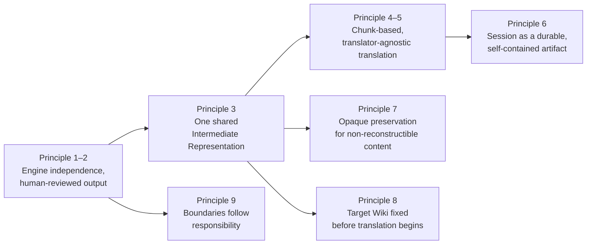

> Was a sentence unclear? Instead of ignoring it, make a simple 'edit' and leave your name in the
> history of this page's improvement.

# Architectural Principles

This document explains the principles that shape every subsystem described in the documents that
follow. Individual documents describe _what_ a subsystem does; this document explains _why_ the
boundaries between subsystems are drawn where they are. Understanding these principles first makes
the rest of the documentation predictable rather than arbitrary.

## 1. The engine is independent of presentation

The [Core Engine](./README.md#system-layers) has no dependency on any UI framework, and no awareness
of how — or whether — its output is displayed. Every stage of translation is expressed as a plain
function or class operating on plain data.

This exists because the engine's job — parsing, resolving, chunking, translating, merging,
generating — is a well-defined transformation that has no inherent relationship to any particular
interface. Keeping that transformation free of presentation concerns means the engine can be driven
by a GUI, a script, or a test harness identically, and means a presentation rewrite touches none of
the logic that actually produces a translation.

## 2. Perseus produces drafts; humans decide what is true

Perseus never publishes to Wikipedia. Every pipeline run ends at a piece of generated Wikitext that
a human reviews and, separately, chooses to publish or discard.

This is not a missing feature, it is a boundary the architecture is built around. Because Perseus's
output is always reviewed before it has any effect, the engine is free to be opinionated, heuristic,
and occasionally wrong (see the discussion of Reference Attention in
[Citation Handling](./citation-handling.md)) without that risk propagating anywhere except a draft a
human was always going to read.

## 3. The Intermediate Representation is the one structural model

Every stage of the pipeline _parsing_, _link resolution_, _chunking_, _translation_, _merging_,
_generation_ reads or writes the same
[Intermediate Representation](./intermediate-representation.md) (IR). There is no second,
stage-specific model that data gets converted into and out of along the way.

This exists so that a concept discovered at one stage — a resolved link, a registered citation — is
immediately visible to every later stage without a translation step of its own. It also means a
stage's job can be described precisely as "what it reads from the IR, and what it adds or changes"
rather than as an isolated transformation with its own private format.

## 4. Translation always operates on chunks, never on a whole article or a single field

Perseus never sends an entire article to a translator in one call, and never treats an individual
sentence or paragraph as its own independent unit of translation work. The unit is always a
[chunk](./chunking-and-translation.md): a bounded group of translatable content, identified,
inspectable, and independently completable.

This exists for two reasons that both follow from Principle 2. First, a chunk is small enough for a
human to read and correct in one sitting, which matters when the human, not the engine, is the final
authority on correctness. Second, a chunk is large enough to give a translator (model or human)
surrounding context — the alternative, translating isolated sentences, produces worse translations
for exactly the reason chunk boundaries themselves can: loss of context. Chunking is the deliberate
middle point between those two failure modes.

## 5. Any translator can produce a chunk's translation, and none of them are privileged

A chunk's translation can come from the built-in LLM executor or from a human pasting a response
from any external AI or writing one by hand. Nothing downstream of a completed chunk — merging,
generation, session persistence — can tell which happened, and nothing needs to.

This is a direct consequence of Principle 2: since a human reviews the output regardless of its
source, the architecture has no reason to trust one translation source over another, or to give the
built-in LLM a code path the manual route doesn't also have.
[Chunking and Translation](./chunking-and-translation.md) describes the single shared protocol that
makes this substitutability real rather than aspirational.

## 6. A translation session is a self-contained artifact, not a transient process

Once an article has been loaded and chunked, the resulting session — the chunks, whatever
translations exist for them so far, and enough of the original article to reconstruct it — can be
saved to disk and reopened later without contacting Wikipedia again, even if the live article has
since changed or been deleted.

This exists because translation is not assumed to happen in one sitting. A contributor may translate
a few chunks, close Perseus, and resume days later using a different translator for the remaining
chunks. Treating the session as a durable, self-contained artifact — the
[Translation Package](./translation-package.md) — rather than in-memory state tied to one running
instance is what makes that pattern reliable instead of best-effort.

## 7. Content that must round-trip exactly is kept opaque, not reconstructed

Where the architecture cannot regenerate something with byte-for-byte fidelity — most notably
citation markup — it does not try. Instead, that content is identified, excluded from translation,
and left untouched from parse through to generation, so the original serialization survives
verbatim.

This exists because reconstruction is a second opportunity to introduce errors that the source
material never had. It is safer, and architecturally simpler, to guarantee correctness by never
disturbing content than to guarantee it by carefully rebuilding content the same way twice. See
[Citation Handling](./citation-handling.md) for where this principle is applied concretely.

## 8. Target Wiki is a precondition of translation, not a translation-time setting

Which wiki an article is being translated for is fixed before an article is loaded, not chosen (or
changed) partway through a session.

This exists because target wiki affects more than translation output — it determines how links are
resolved during parsing, which happens before any translation occurs. A setting that link resolution
depends on cannot be scoped to "only when using the built-in translator," since link resolution runs
regardless of which translator is eventually used. [Target Wiki](./target-wiki.md) describes what
depends on this choice and why it is locked once an article is loaded.

## 9. Subsystem boundaries follow responsibility, not convenience

Each subsystem in this documentation set — pipeline orchestration, the IR, chunking, citation
handling, target wiki configuration, provider integration — owns exactly one responsibility, and
other subsystems interact with it only through its own interface. A subsystem is never extended to
absorb a responsibility that belongs to another simply because the two happen to run at a similar
time.

The clearest example is citation handling: preserving citations could have been implemented as
special-case logic inside merging or generation, since that is where the original defect manifested.
Instead it is implemented as its own registration pass and its own protected-content rule, applied
at parse time, so that merging and generation remain unaware citations require any special handling
at all. A subsystem boundary, in this architecture, is drawn around a single responsibility — not
around wherever a bug happened to surface.

The documents that follow each expand on one subsystem. Where a decision in that subsystem traces
back to one of these principles, the document links here rather than re-arguing the case.
