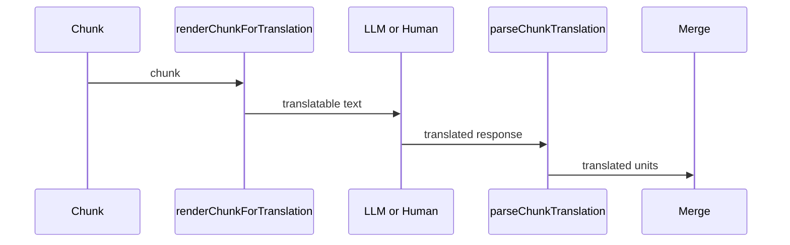
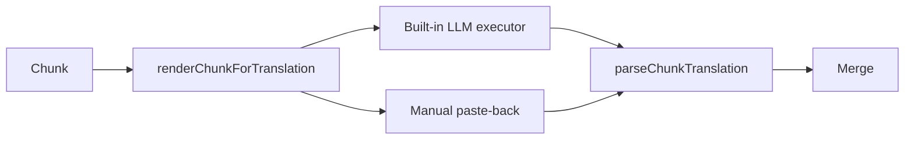

> Was a sentence unclear? Instead of ignoring it, make a simple 'edit' and leave your name in the
> history of this page's improvement.

# Chunking and Translation

Chunking and translation together implement Architectural Principles
[§4 and §5](./architectural-principles.md#4-translation-always-operates-on-chunks-never-on-a-whole-article-or-a-single-field):
translation always operates on a bounded, inspectable unit, and any executor — the built-in LLM or a
human — can produce that unit's translation through one shared protocol.

## Chunks

A chunk is a group of the [Intermediate Representation](./intermediate-representation.md)'s
extracted, translatable content, bounded by a character budget rather than by document structure (so
a chunk may span several paragraphs, but never splits one). Chunking is a pure, deterministic
function of the extraction worklist: the same worklist and budget always produce the same chunks, in
the same order, with the same ids.

Chunks are computed exactly once per session, immediately after extraction, and are treated as fixed
from that point on — they are not recomputed later, even if the chunking algorithm or default budget
subsequently changes. A session's chunk boundaries are part of that session's identity, not a value
re-derived on demand. This is what lets a session be saved and reopened, possibly by a different
build of Perseus, with identical chunk ids and grouping every time — see
[Translation Package](./translation-package.md).

## The shared render/parse protocol

Every executor — built-in or manual — turns a chunk into translatable text, and turns a response
back into translated text, using exactly the same two operations:

- **`renderChunkForTranslation`** turns a chunk into the exact text a translator sees — the same
  text whether it becomes a request body sent to a model or text copied to a clipboard for a human
  to paste elsewhere.
- **`parseChunkTranslation`** turns a response back into translated units, regardless of whether
  that response came from a model's API reply or a human's pasted text. It is tolerant of partial or
  malformed input: units that parse successfully are applied, and units that don't are reported
  rather than causing the whole chunk to fail. A single dropped marker in a human's paste therefore
  degrades to "one unit still needs attention," not "this chunk's translation is lost."

Neither function has any awareness of which executor is calling it. That is the entire mechanism
behind chunk translations being interchangeable regardless of source: a chunk translated by the
built-in LLM and a chunk translated by a human pasting from an external tool are indistinguishable
by the time they reach Merge.

## Executors

- The **built-in executor** calls a configured [LLM provider](./llm-providers.md) with a chunk's
  rendered text and parses the response automatically. Running it across every unfinished chunk in
  order reproduces a full-article translation as a sequence of single-chunk calls, which is what
  makes it interruptible: it can stop after any chunk and resume later without losing progress.
- **Manual translation** is not a distinct code path so much as the same `parseChunkTranslation`
  call invoked on whatever text a human pastes back, from any external AI tool or typed by hand.

Because both executors terminate at the same parse step, a translation session can freely mix them:
some chunks completed automatically, others by hand, in any order, resumed any number of times, with
Merge never needing to know the difference.
