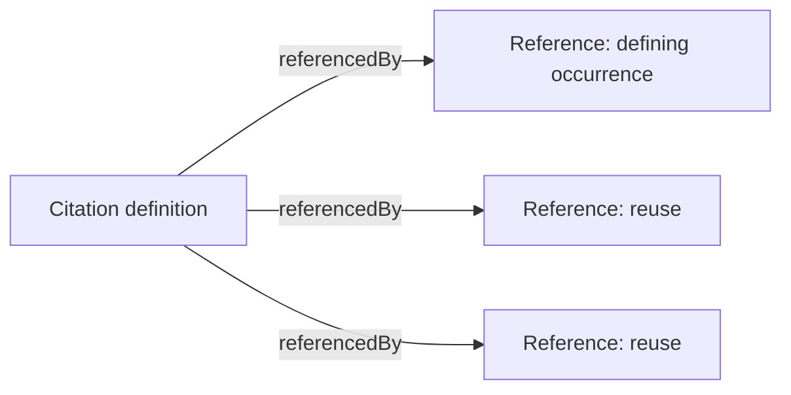
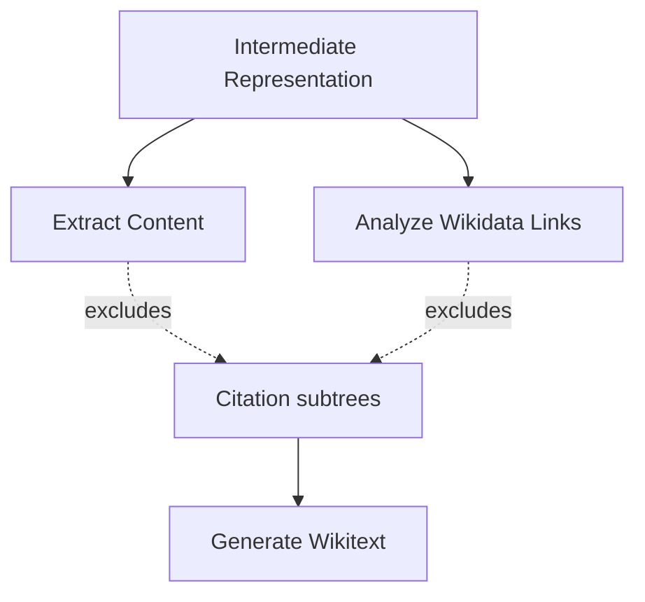

> Was a sentence unclear? Instead of ignoring it, make a simple 'edit' and leave your name in the
> history of this page's improvement.

# Citation Handling

Citation handling preserves a citation's original markup exactly, rather than translating and
reconstructing it. It is the concrete application of Architectural Principle
[§7](./architectural-principles.md#7-content-that-must-round-trip-exactly-is-kept-opaque-not-reconstructed):
citations carry structure that cannot be safely regenerated, so the architecture guarantees their
fidelity by never disturbing them at all.

## Why citations are treated differently from ordinary text

A citation's real content — its template call, parameters, and exact original shape — lives in
metadata attached to it, not in the text a reader sees. The only component that knows how to turn
that metadata back into correct Wikitext is the same external serializer
[Generate Wikitext](./pipeline.md) already calls for the rest of the document. Perseus does not
attempt to reconstruct citation syntax itself; it only has to ensure that metadata is never touched
between parsing and generation.

## Registry

Citations are represented in the [Intermediate Representation](./intermediate-representation.md) as
a registry of two occurrence kinds, alongside `textNodes` and `links`:

- **A definition** — where a citation's real content lives. There is exactly one per uniquely named
  citation.
- **A reference** — every place a citation is invoked, including the defining occurrence itself and
  every subsequent reuse.

The registry is built during Parse, in two passes, specifically so that resolution does not depend
on document order: a reuse can legally appear before the definition it points to, so definitions are
registered first, in a complete first pass, before any reference is resolved against them in a
second. This makes "this reference is unresolved" a statement about the article's actual content,
never an artifact of where something happened to appear.

Anomalies the registry encounters — an unresolvable reference, a definition nothing points to, a
citation whose metadata could not be read — are recorded as warnings rather than treated as
failures, consistent with Architectural Principle
[§2](./architectural-principles.md#2-perseus-produces-drafts-humans-decide-what-is-true): the
pipeline surfaces the anomaly for review rather than deciding on the article's behalf that
translation cannot proceed.

## Protected content

Citation subtrees are excluded from both of the pipeline stages that would otherwise select or
mutate them:

- **Extraction** never selects a citation definition as translatable content, so its text is never
  sent to a translator and never overwritten.
- **Link resolution** never resolves links that happen to appear inside a citation (for example, an
  author's wikilink inside a citation template). This is a deliberate scope decision: preserving a
  citation intact is a correctness requirement, while localizing a link inside one is a nice-to-have
  that can be added later without changing this design.

Within an ordinary paragraph that mixes translatable prose with an inline citation marker, the
marker itself is represented as a single, non-recursive token during translation — nothing inside it
is ever visible to a translator — and is restored using its own original markup, verbatim, once
translation is complete. This is what allows a paragraph to be translated normally while the
citation marker sitting inside it survives untouched.

## Why no new reconstruction logic is needed

Because citation content is never selected for translation and never rewritten, merging and Wikitext
generation require no citation-specific logic at all: merging writes translated text only into nodes
it is given, and generation serializes the whole document — citations included — through the same
transform used for everything else. Citation fidelity is a consequence of citations never entering
the parts of the pipeline that change content, not of any dedicated reconstruction step.

This is also why citation-internal translation — translating a human-readable field like a title
inside a citation — is treated as out of scope by design rather than as a missing feature: doing so
safely would mean writing translated text back into that same metadata precisely enough not to break
the serializer's round trip, which is exactly the kind of fragile, narrowly-correct reconstruction
this architecture otherwise avoids entirely.
