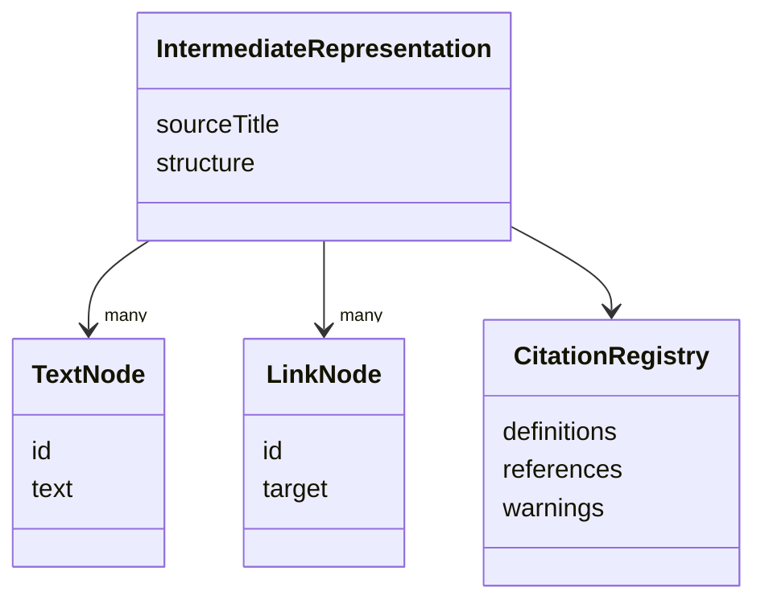
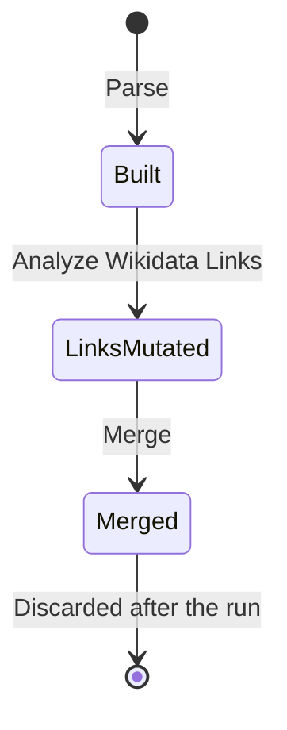

> Was a sentence unclear? Instead of ignoring it, make a simple 'edit' and leave your name in the
> history of this page's improvement.

# Intermediate Representation

The Intermediate Representation (IR) is the single structural model of an article that every
pipeline stage reads or writes. There is no per-stage data format that content gets converted into
and back out of — a concept added to the IR by one stage is immediately visible, in the same shape,
to every stage that runs after it. This is Architectural Principle
[§3](./architectural-principles.md#3-the-intermediate-representation-is-the-one-structural-model) in
concrete form.

## Shape

- **`textNodes`** — every unit of translatable text in the article. A `TextNode`'s text starts as
  the original English and is overwritten in place with its translation; there is no separate
  "source" and "result" field, because the node itself _is_ the article's current state for that
  unit, not a record of a transformation applied to something else.
- **`links`** — every wikilink in the article, resolved against the configured
  [Target Wiki](./target-wiki.md).
- **`citations`** — the registry of citation definitions and references, described in
  [Citation Handling](./citation-handling.md). It exists as its own field, alongside `textNodes` and
  `links`, rather than as a special kind of either, because citation content follows different rules
  from both: it is read and tracked, but — unlike a `TextNode` — never translated, and — unlike a
  `LinkNode` — never resolved.
- **`structure`** — the document's shape independent of any individual node's content, used to
  reassemble a complete article once every node has whatever content it will end up with.

Ids across all three node kinds share one scheme, assigned deterministically by traversal order
during parsing. The same input produces the same ids every time — a property the
[Translation Package](./translation-package.md) depends on directly.

## Lifecycle

The IR is built once, by Parse, and only three stages ever mutate it afterward:

1. **Parse** builds the IR from scratch, including registering citation structure.
2. **Analyze Wikidata Links** mutates `LinkNode`s with resolved destinations.
3. **Merge** mutates `TextNode`s with translated text, one chunk at a time.

Every other stage — Extract, Chunk, Translate, Generate — reads the IR without changing it. Extract
does not mutate the IR when it builds a worklist; it selects from it. Chunking and translation
operate on that worklist and its resulting text, not on the IR directly, until Merge writes the
result back.

The IR itself is never persisted — it exists only for the duration of a single pipeline run and is
discarded once Generation has produced Wikitext, or once a session is closed. This is why a
[Translation Package](./translation-package.md) cannot simply serialize the IR to resume a session
later: it instead stores a reconstruction anchor and relies on deterministic id assignment to
rebuild an equivalent IR when the session is reopened.
