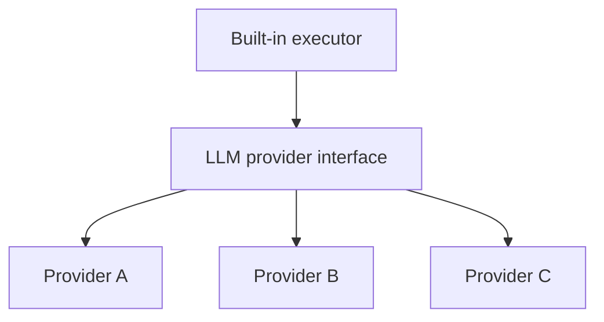

> Was a sentence unclear? Instead of ignoring it, make a simple 'edit' and leave your name in the
> history of this page's improvement.

# LLM Providers

The LLM provider abstraction is what lets the built-in translation executor call any of several
interchangeable model backends through one interface, rather than being written against a specific
model API.

## The provider interface

A provider's role is narrow by design: given a chunk's rendered translation request, return a
response. It has no awareness of chunks, sessions, or the pipeline — those concepts belong to
[Chunking and Translation](./chunking-and-translation.md), which calls a configured provider only at
the point where a rendered request needs to become a raw response. This narrowness is what allows
Perseus to support several providers side by side: each one only has to satisfy the same small
request/response contract, not reimplement any part of the translation flow itself.

## Relationship to the shared translation protocol

The provider interface sits entirely inside the built-in executor described in
[Chunking and Translation](./chunking-and-translation.md#executors). A provider is never handed a
raw chunk and never sees `renderChunkForTranslation` or `parseChunkTranslation`'s internals — it
receives already-rendered text and returns raw text, which the executor then parses using the same
function a human paste-back would use. Swapping providers therefore changes nothing about how a
chunk is rendered, parsed, or merged; it only changes which service produced the response. This is
the model-layer expression of Architectural Principle
[§5](./architectural-principles.md#5-any-translator-can-produce-a-chunks-translation-and-none-of-them-are-privileged):
a configured provider is one substitutable translator among others, including the human manually
pasting from an entirely different, unconfigured AI tool.

## Prompt construction

The instructions accompanying a translation request are built once, from the article's configured
[Target Wiki](./target-wiki.md), rather than being hard-coded per provider or reconstructed per
chunk. The same constructed prompt is used whether it is sent automatically as part of a built-in
provider call or copied once for a human to paste into an external tool themselves — prompt
construction does not distinguish between the two, for the same reason nothing else in the
translation flow does.
