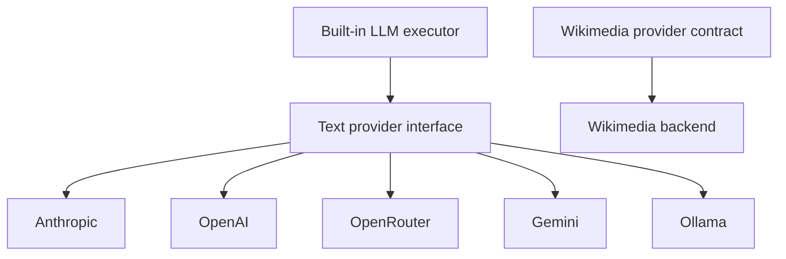
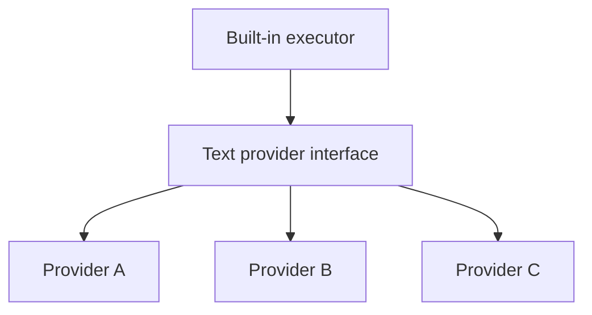

> Was a sentence unclear? Instead of ignoring it, make a simple 'edit' and leave your name in the
> history of this page's improvement.

# LLM Providers

Perseus supports two categorically different kinds of translation provider. This document covers
both, and — deliberately — treats them as separate concepts rather than variations on one interface.

## Two provider families, not one

```mermaid
flowchart TB
    Exec[Built-in LLM executor] --> TIFace[Text provider interface]
    TIFace --> P1[Anthropic]
    TIFace --> P2[OpenAI]
    TIFace --> P3[OpenRouter]
    TIFace --> P4[Gemini]
    TIFace --> P5[Ollama]

    WIFace[Wikimedia provider contract] --> WP[Wikimedia backend]
```

- **Text providers** — Anthropic, OpenAI, OpenRouter, Gemini, and Ollama — all implement the same
  narrow request/response contract described below, and are the only providers the built-in
  translation executor ([Chunking and Translation](./chunking-and-translation.md#executors)) actually
  drives.
- **The Wikimedia provider** implements a completely different contract, described in its own
  section below. **It is not a sixth interchangeable text provider**, and should not be reasoned
  about as one: it operates on whole Wikipedia revisions and chunk batches, not on one rendered
  request at a time, and it is not wired into the built-in pipeline today — selecting it as the
  active provider fails with a clear configuration error rather than silently behaving like a text
  provider. Keeping it a distinct contract, rather than forcing it to conform to the text interface,
  is what keeps the text-provider abstraction narrow enough to stay easy to add a sixth *text*
  provider to.

## The text provider interface

```mermaid
flowchart TB
    Exec[Built-in executor] --> IFace[Text provider interface]
    IFace --> P1[Provider A]
    IFace --> P2[Provider B]
    IFace --> P3[Provider C]
```

A text provider's role is narrow by design: given a chunk's rendered translation request, return a
response. It has no awareness of chunks, sessions, or the pipeline — those concepts belong to
[Chunking and Translation](./chunking-and-translation.md), which calls a configured provider only at
the point where a rendered request needs to become a raw response. This narrowness is what allows
Perseus to support several text providers side by side: each one only has to satisfy the same small
request/response contract, not reimplement any part of the translation flow itself.

### Relationship to the shared translation protocol

The text provider interface sits entirely inside the built-in executor described in
[Chunking and Translation](./chunking-and-translation.md#executors). A provider is never handed a
raw chunk and never sees `renderChunkForTranslation` or `parseChunkTranslation`'s internals — it
receives already-rendered text and returns raw text, which the executor then parses using the same
function a human paste-back would use. Swapping text providers therefore changes nothing about how a
chunk is rendered, parsed, or merged; it only changes which service produced the response. This is
the model-layer expression of Architectural Principle
[§5](./architectural-principles.md#5-any-translator-can-produce-a-chunks-translation-and-none-of-them-are-privileged):
a configured provider is one substitutable translator among others, including the human manually
pasting from an entirely different, unconfigured AI tool.

### Prompt construction

The instructions accompanying a translation request are built once, from the article's configured
[Target Wiki](./target-wiki.md), rather than being hard-coded per provider or reconstructed per
chunk. The same constructed prompt is used whether it is sent automatically as part of a built-in
provider call or copied once for a human to paste into an external tool themselves — prompt
construction does not distinguish between the two, for the same reason nothing else in the
translation flow does.

## The Wikimedia provider

The Wikimedia provider talks to a Perseus-operated backend service rather than a general-purpose
model API. Its request identifies a whole article revision — source wiki, page id, and revision id —
plus a specific chunk of that revision (or `"all"`), and its response reports translation outcomes
across the whole document at once: translated units grouped by chunk, chunks that failed at the
provider, and chunks skipped because a quota was exhausted. None of that has an equivalent in the
text provider contract above, which only ever sees one rendered request and returns one raw response.

This shape is why the Wikimedia provider is not treated as a text provider with a different backend:
a text provider's contract has no concept of "this chunk succeeded but that one didn't" or "resume
translating this specific chunk of this specific revision" — those are the Wikimedia backend's own
concerns, not something the shared chunk-render/parse protocol was built to express. Selecting
Wikimedia as the active provider is accepted by configuration, but constructing a runnable pipeline
from it currently fails deliberately, with an explicit configuration error, rather than attempting to
drive it through the text-provider executor and producing subtly wrong behavior.

### What is and isn't documented here

The Wikimedia provider's client-side contract — the shape of the request it sends and the response it
expects — is implemented in Perseus and is accurately described above. The backend service that
receives that request is reached at a fixed HTTPS endpoint on a `workers.dev` domain, which places it
on Cloudflare Workers; beyond that hosting detail, its own internal implementation (routing framework,
request handling, whether or how it uses Hono, its own architecture) is not part of this repository
and is not verifiable from the client code alone. This document does not claim to describe that
service's architecture. Anyone extending Wikimedia support should treat the backend as an external
dependency with a known request/response contract, not assume anything about how it is built beyond
that contract.
