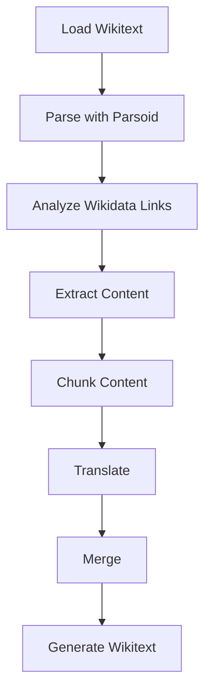
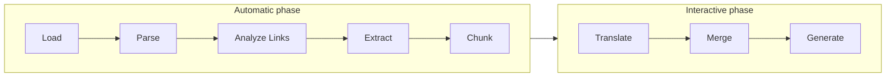
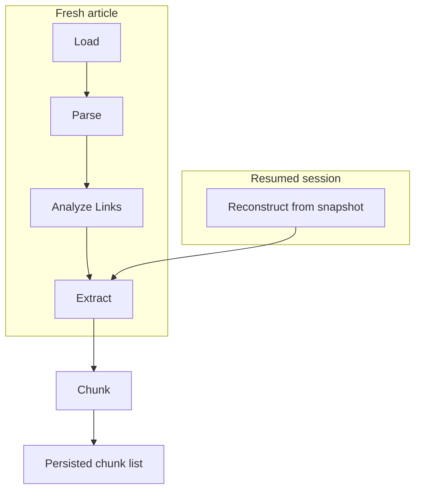

> Was a sentence unclear? Instead of ignoring it, make a simple 'edit' and leave your name in the
> history of this page's improvement.

# Pipeline

The pipeline is the sequence a source article moves through on its way to generated Wikitext. It
exists to give every stage of translation a fixed place in a fixed order, so that "what happens
before X" and "what X can assume already exists" are always answerable without reading the stage's
own logic.

## Stages

- **Load Wikitext** — retrieves the source article, from a live Wikipedia URL or a local file.
- **Parse with Parsoid** — builds the
  [Intermediate Representation](./intermediate-representation.md) from the article's HTML, and
  registers citation structure into it (see [Citation Handling](./citation-handling.md)).
- **Analyze Wikidata Links** — resolves the IR's links against the configured
  [Target Wiki](./target-wiki.md), so translated output points at the correct destination articles.
- **Extract Content** — selects the IR's translatable content into an ordered worklist, excluding
  anything inside a [protected region](./citation-handling.md#protected-content) such as a citation.
- **Chunk Content** — groups the worklist into [chunks](./chunking-and-translation.md), the unit
  translation always operates on.
- **Translate** — produces translated text for a chunk, by whichever
  [executor](./chunking-and-translation.md#executors) the user chooses.
- **Merge** — writes a chunk's translated text back into the Intermediate Representation.
- **Generate Wikitext** — serializes the fully-merged IR back into Wikitext.

## Two phases, two different execution models

The first five stages — Load through Chunk — always run together, automatically, as one synchronous
pass with no user decision point in the middle. The last three — Translate, Merge, Generate — do
not.

This split exists because translation, unlike loading and chunking, is not a single deterministic
transformation — it can be carried out by different executors, interrupted, resumed, and repeated
per chunk (Architectural Principles
[§4–5](./architectural-principles.md#4-translation-always-operates-on-chunks-never-on-a-whole-article-or-a-single-field)).
Merge happens incrementally, once per chunk, as soon as that chunk's translation is available — it
does not wait for every chunk to finish. Generation is the one exception kept explicit and
user-triggered rather than automatic: it is the only stage that costs a live call to an external
Wikitext-serialization service, so the pipeline never performs it as a side effect of merging.

## Two ways to enter the pipeline

An article does not always enter the pipeline through Load. A saved
[Translation Package](./translation-package.md) can instead reconstruct its Intermediate
Representation directly from its own stored snapshot, skipping Load, Parse's network dependency, and
Link Resolution's, while still producing the same IR shape every later stage expects.

Both paths converge on the same chunk list, which is why nothing downstream of Chunk needs to know
which entry point was used. This convergence is what makes a session in the
[Translation Package](./translation-package.md) genuinely resumable rather than a re-run of the
original load.

## Non-fatal stages

No stage's failure is fatal to the pipeline as a whole; a stage that encounters an anomaly (an
unresolvable citation reference, an unreachable Wikidata entity) records it rather than aborting.
This follows from Architectural Principle
[§2](./architectural-principles.md#2-perseus-produces-drafts-humans-decide-what-is-true): since a
human always reviews the output, the pipeline's job is to surface problems for that review, not to
pre-emptively decide a translation cannot proceed.
