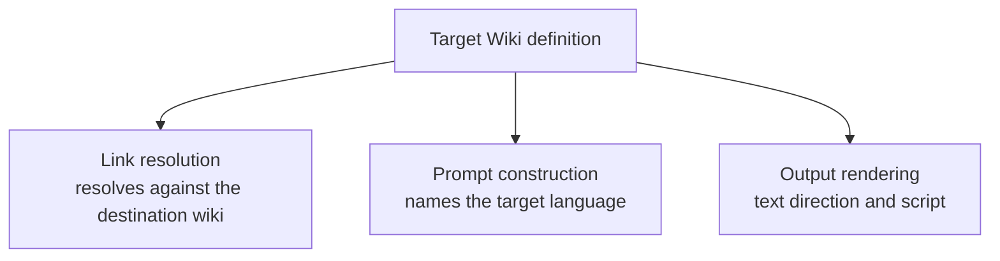

> Was a sentence unclear? Instead of ignoring it, make a simple 'edit' and leave your name in the
> history of this page's improvement.

# Target Wiki

Target Wiki identifies which wiki an article is being translated for, and is the configuration
boundary described in Architectural Principle
[§8](./architectural-principles.md#8-target-wiki-is-a-precondition-of-translation-not-a-translation-time-setting):
it is chosen once, before an article is loaded, not adjusted during translation.

## Why it must be chosen before loading an article

[Analyze Wikidata Links](./pipeline.md), which runs during the pipeline's automatic phase, resolves
the article's links against the destination wiki — a step that happens regardless of which
[translation executor](./chunking-and-translation.md#executors) is later used. A setting that link
resolution depends on cannot be scoped to only one executor, since link resolution itself has no
concept of executors at all. Choosing Target Wiki up front, before Load, is what keeps it a single
input to the whole pipeline rather than a built-in-translator-only preference.

## What depends on it

- **Link resolution** resolves the article's wikilinks against the chosen wiki's own articles,
  rather than a fixed destination.
- **Prompt construction** — shared by every use of a configured [LLM provider](./llm-providers.md) —
  names the target language and wiki rather than assuming a single fixed one.
- **Output rendering** follows the target wiki's own writing direction and script (for example,
  right-to-left for one supported wiki, left-to-right for another), independent of whatever language
  Perseus's own interface happens to be displayed in.

Each of these reads the same definition — a code, display name, language name, destination domain,
and writing direction — rather than each independently assuming a fixed target, which is what keeps
adding a further supported wiki a matter of adding one definition rather than changing three
unrelated places.

## Locked for the life of a session

Once an article has been loaded, its Target Wiki cannot change for the rest of that session. This
follows directly from the previous section: link resolution has already run against a specific wiki
by the time chunking or translation begins, so changing the target afterward would leave
already-resolved links pointing at the wrong destination while everything translated after the
change assumed a different one.

The Target Wiki a session was actually created under is recorded at the moment link resolution runs,
not re-read from whatever the current configuration says later. This is what keeps a
[Translation Package](./translation-package.md)'s recorded target wiki accurate even if the user
changes the configured default before saving or reopening that session.
