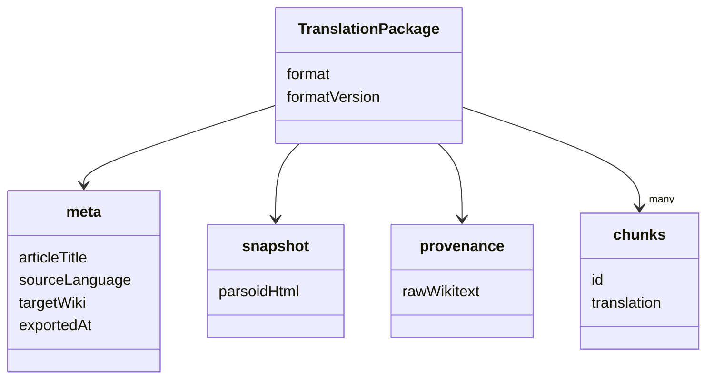
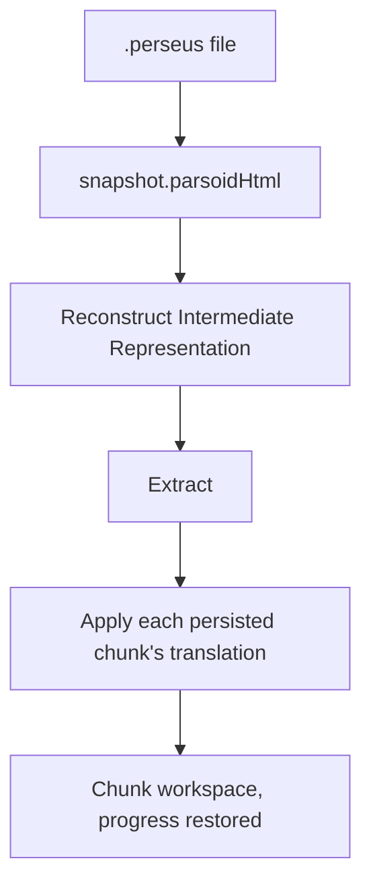

> Was a sentence unclear? Instead of ignoring it, make a simple 'edit' and leave your name in the
> history of this page's improvement.

# Translation Package

The Translation Package is the on-disk, self-contained representation of a translation session — the
`.perseus` file. It exists because of Architectural Principle
[§6](./architectural-principles.md#6-a-translation-session-is-a-self-contained-artifact-not-a-transient-process):
a session must be closeable and resumable, potentially much later, without depending on the live
article still existing in its original form.

## Why self-containment requires more than the chunks themselves

The [Intermediate Representation](./intermediate-representation.md) is never persisted — it is
rebuilt fresh by Parse each time an article is loaded, and node ids are only stable because they are
assigned deterministically from the same input. Persisting only a session's chunk translations would
therefore not be enough to reopen it safely: reconstructing the IR they refer to would require
re-fetching and re-parsing the live article, and if that article has changed at all since the
session was exported, re-parsing can silently assign different ids to different content — a saved
translation could land on the wrong paragraph with no error at all.

The package avoids this by storing its own reconstruction input rather than relying on the live
article a second time.

## File shape

- **`meta`**: identifying information about the session, including which
  [Target Wiki](./target-wiki.md) was active when the article was loaded, recorded at that moment
  rather than re-read from current configuration, so a reopened session cannot drift from the
  settings it was actually created under.
- **`snapshot`**: the reconstruction anchor: the parsed article HTML captured once, immediately
  after extraction, before any translation has touched it. Reopening a session reconstructs the
  Intermediate Representation from this snapshot rather than from a fresh fetch, which is what
  guarantees the same node ids every time and makes reopening independent of whether the live
  article still exists or has changed.
- **`provenance`**: the original Wikitext, kept for human inspection only. It is not used for
  reconstruction, because regenerating Wikitext from the snapshot's HTML would itself require a
  second, lossy round trip — the two representations are stored independently rather than derived
  from one another.
  - The original rawWikitext is preserved so the original English version can later be compared side
    by side with the user's final translated version.
- **`chunks`**: the session's chunk translations, grouped by chunk id exactly as
  [chunking](./chunking-and-translation.md#chunks) produced them. This is the only part of the file
  relevant to a human or an external AI working with a chunk directly.

## Opening a session

Opening a saved session reconstructs the `IR` from `snapshot`, then applies each persisted chunk's
translation against it — the same per-chunk apply step Merge always performs, run once per chunk
already saved. This is also why chunk grouping is persisted rather than recomputed on open: the
session's chunks are treated as fixed, so reopening reproduces exactly the chunk list that was being
worked on when it was saved, regardless of any change to chunking behavior since.
