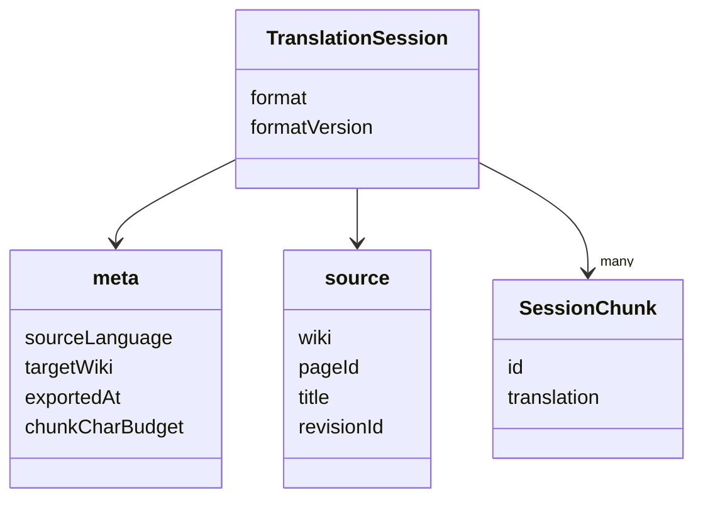
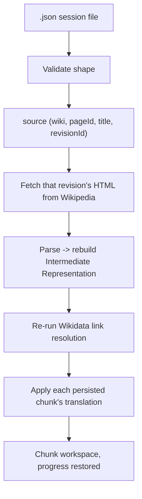

> Was a sentence unclear? Instead of ignoring it, make a simple 'edit' and leave your name in the
> history of this page's improvement.

# Translation Session

A Translation Session is the on-disk, JSON representation of a translation in progress — a `.json`
file. It exists because of Architectural Principle
[§6](./architectural-principles.md#6-a-translation-session-is-a-durable-artifact-not-a-transient-process):
translation is not assumed to happen in one sitting, so a session must be closeable and reopenable
later.

Translation Session replaces what earlier documentation called the Translation Package. The rename
tracks a real change in role, not just a naming preference: it started as a one-shot exchange format
for handing chunks to an external translator, and has grown into the save/resume checkpoint for the
whole chunk workspace — the same file format now backs both "export this session so an external AI
can translate it" and "close Perseus and pick this up again tomorrow."

## Why reconstruction now means re-fetching, not re-embedding

A Translation Session does **not** store a snapshot of the article's parsed HTML, and does not carry
any provenance/original-Wikitext copy either. Both existed in an earlier design and have been
removed. What it stores instead, in `source`, is just enough metadata to identify one immutable
Wikipedia revision:

```json
"source": {
  "wiki": "enwiki",
  "pageId": 73096,
  "title": "John Nelson Darby",
  "revisionId": 1349839432
}
```

- **`wiki`** — the Wikidata-style database code of the source wiki. Always `"enwiki"` today (Perseus
  only translates from English Wikipedia), but recorded explicitly rather than assumed, so a session
  file unambiguously documents what `pageId`/`revisionId` refer to.
- **`pageId`** — the stable identifier of the article as a whole.
- **`revisionId`** — the identifier of the *exact* historical revision the session's chunks were
  derived from. This, not `title`, is what reconstruction actually keys on: MediaWiki's revision
  endpoint (`GET /w/rest.php/v1/revision/{revisionId}/html`) returns that revision's content
  regardless of any edits made to the live article since, or even if the article has since been
  renamed. `title` is kept purely for display — reopening a session never re-resolves the *current*
  article behind a title.

This is a deliberate trade-off, not an oversight: reconstruction now requires an internet connection
every time (there is no offline restoration path), in exchange for the file itself staying small and
never risking drift between an embedded snapshot and the format the parser currently expects. A
`revisionId` is a permanent, load-bearing reference to Wikipedia's own storage, which does not go
stale the way a locally cached parse of that content could.

## File shape



```json
{
  "format": "perseus-package",
  "formatVersion": 1,
  "meta": {
    "sourceLanguage": "en",
    "targetWiki": "fa",
    "exportedAt": "2026-07-26T10:30:04.646Z",
    "chunkCharBudget": 2500
  },
  "source": {
    "wiki": "enwiki",
    "pageId": 73096,
    "title": "John Nelson Darby",
    "revisionId": 1349839432
  },
  "chunks": [
    { "id": "chunk-1", "translation": [[7, "p", "..."], [8, "p", "..."]] }
  ]
}
```

(`"format": "perseus-package"` is a historical string value carried over from before the rename —
see [Known inconsistencies](#known-inconsistencies) below. It identifies the file format, not a
`.perseus` file extension; the file on disk is `.json`.)

- **`format` / `formatVersion`** — a fixed marker and a version number, checked on open so a file
  that doesn't look like a Perseus session, or was written by an incompatible future version, fails
  with a clear error rather than a confusing downstream one. Perseus hasn't shipped externally yet,
  so `formatVersion` has never needed a second value — but the check, and a version-dispatch point in
  the validator, already exist for when it does. The versioning policy: adding an optional key is not
  a breaking change; changing the meaning or shape of an existing key is, and bumps this number.
- **`meta`**: identifying information about the session — source language (always `"en"`), which
  [Target Wiki](./target-wiki.md) was active, when it was last saved, and the character budget
  [chunking](./chunking-and-translation.md) used when this session's chunks were first derived. The
  target wiki is recorded at the moment it was actually used, not re-read from current configuration,
  so a reopened session cannot silently pick up a default the user has since changed. The character
  budget is informational only — chunks are persisted, never re-derived from it.
- **`source`**: the sole reconstruction input, described above.
- **`chunks`**: the session's actual translation work, and the only part of the file a human or an
  external AI ever needs to look at. Each chunk carries the same `id` [chunking](./chunking-and-translation.md)
  assigned it, and a `translation` array of `[id, tag, text]` tuples — one per translatable unit:
  a numeric node id, its HTML tag (`"p"`, `"h2"`, ...), and one mutable `text` field that starts as
  the English source and is overwritten in place with its translation. There is no separate
  source/result field: the original is always re-derivable by re-fetching `source`, so storing it a
  second time would be pure duplication.

## Two different translation protocols, not one

Chunks reach a Translation Session's `translation` tuples through one of two distinct paths, and it
matters which:

1. **Interactively, inside the chunk workspace.** Both the built-in LLM executor and a human pasting
   from an external tool go through the `[[SEGMENT n]]`-marker render/parse protocol described in
   [Chunking and Translation](./chunking-and-translation.md#the-shared-renderparse-protocol). A
   session is only ever written to disk from this state — `exportTranslationSession` reads each
   chunk's *current* text directly off the live Intermediate Representation, it does not itself
   render or parse anything.
2. **Externally, against the exported file itself.** A saved session's `chunks` array can be handed
   to a human or an external AI as a self-contained artifact — the whole session, not one chunk at a
   time — with the accompanying instruction to replace each tuple's `text` in place and leave `id`
   and `tag` untouched. This is a different, simpler wire format from `[[SEGMENT n]]` markers,
   because a whole JSON file (rather than one chunk's worth of plain text pasted into a chat window)
   is the unit being exchanged. Re-importing that edited file runs through
   [`validateTranslationSession`](#validating-an-untrusted-file), then applies each chunk exactly as
   described below.

Both protocols still converge on the same place: whichever tuples changed get merged into the IR
through the same [`Merger`](./intermediate-representation.md#lifecycle) either way.

## Validating an untrusted file

A session file may have come from anywhere — disk, a hand edit, or output from an external AI — so
nothing about its shape can be assumed safe. Opening one runs it through dependency-free, deterministic
validation before anything downstream sees it: every field is type- and shape-checked, `format` and
`formatVersion` are checked against the values this build understands, `source.wiki` is checked
against the one source wiki Perseus supports, and duplicate chunk ids or duplicate entry ids across
the whole session are rejected outright, since the apply step keys entries by id and silently
overwriting one would lose a translation with no error at all. Any failure raises a specific,
actionable error rather than a generic parse failure.

## Opening a session



Opening a saved session re-fetches the exact revision named in `source`, rebuilds the Intermediate
Representation from it the same way a fresh Load would, **re-runs Wikidata link resolution** (the
earlier snapshot-based design skipped this; the current one has nothing cached to skip it with), then
applies each persisted chunk's translation entries against the rebuilt IR — the same per-chunk apply
step Merge always performs, run once per chunk already saved. Reconstruction is only possible with
network access throughout: fetching the revision, re-resolving links, and — once the user asks to see
current output — generating Wikitext all require live calls. There is no offline restoration path.

Each entry's applied/skipped outcome follows a small set of fixed rules: a tuple whose `text` differs
from the freshly reconstructed node's original text is applied as a translation; a tuple identical to
the original is treated as a no-op (as if it had never been included) rather than as an explicit
"translated to itself"; an id with no matching node in the reconstructed IR is ignored and reported
back to the caller, rather than failing the whole session; and entry order is irrelevant, since
matching is always by id.

Chunk grouping itself is never recomputed on open — the session's chunks are treated as fixed, so
reopening reproduces exactly the chunk list that was being worked on when it was saved, regardless of
any change to chunking behavior since. See
[Chunking and Translation](./chunking-and-translation.md#chunks) for why chunk boundaries are
computed once and then frozen.

## Known inconsistencies

The on-disk `format` marker is still the literal string `"perseus-package"`, a holdover from before
the Translation Package → Translation Session rename. It is meaningful only as an opaque compatibility
marker checked by the validator — nothing reads it as a signal that the file is (or was ever) a
`.perseus` file — but it is worth knowing about if you're reading a raw session file and wondering why
its `format` field doesn't say `"perseus-session"`.
